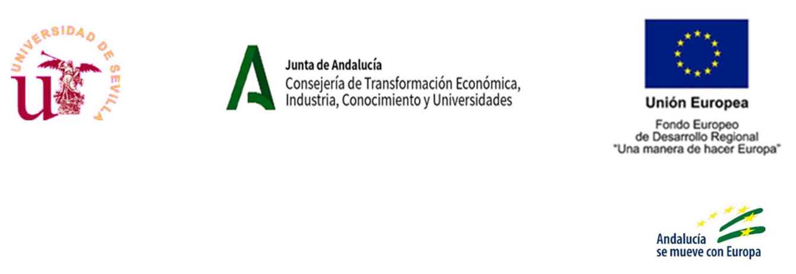

# Taller: Desarrollo de paquetes de R útiles en ecología

## Objetivos

Los **objetivos** de este taller son:

- Proveer **formación** en herramientas de control de versiones y técnicas de programación colaborativa (git, GitHub, Quarto, etc)

- Desarrollar y publicar **software** (paquetes de R) de utilidad en ecología y medio ambiente

- Promover la **ciencia abierta y reproducible** en el campo de la ecología

## Calendario

**Primera fase**: 22 - 24 marzo 2023

**Segunda fase**: mayo 2023 (fechas por determinar)

## Financiación

Este taller ha sido financiado por el Fondo Europeo de Desarrollo Regional (FEDER) y por la Consejería de Transformación Económica, Industria, Conocimiento y Universidades de la Junta de Andalucía (proyecto US-1381388 liderado por [Francisco Rodríguez Sánchez](https://frodriguezsanchez.net)), y cuenta con la colaboración de la Asociación Española de Ecología Terrestre ([AEET](https://www.aeet.org)). 

